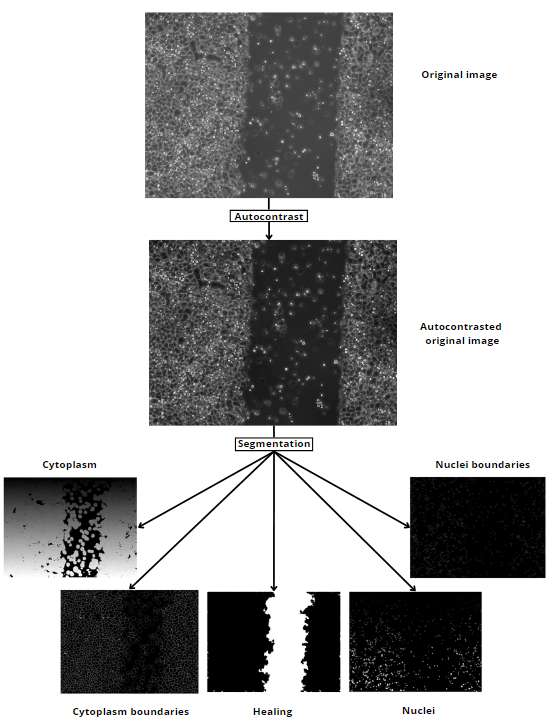
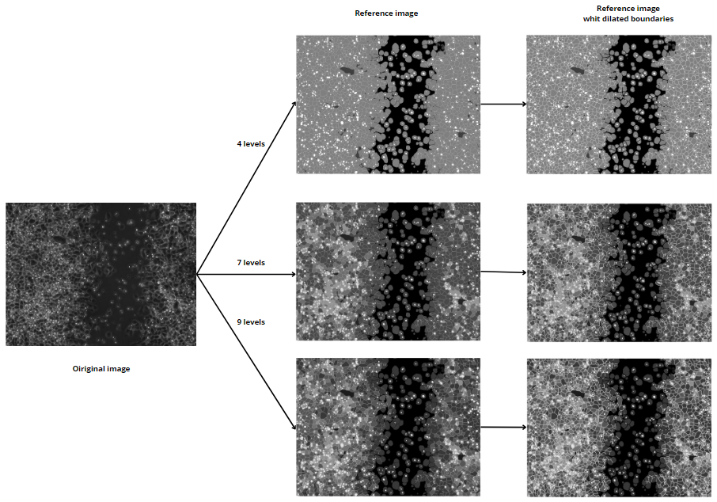
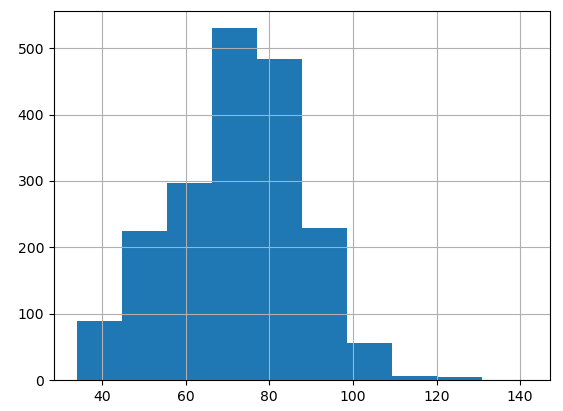
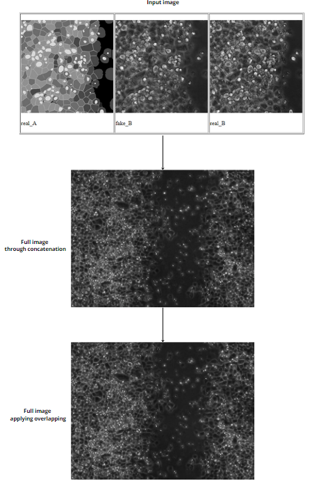

# Biomedical-Image-Generation
## Introduction
Welcome to the Biomedical Image Generation repository. This repository contains the comprehensive codebase and requirements necessary for generating synthetic biomedical images with pix2pix. It provides detailed explanations for each component, covering the entire process from initial segmentation to the generation of reference images, and culminating in the final model training.

To optimize performance and reduce execution time, it is recommended to run this code on a GPU-enabled device. The codebase is highly adaptable, allowing for modifications to suit various requirements. In particular, the segmentation tool is designed to be customizable, ensuring specificity for different biomedical imaging scenarios.

## Part 0: Enviroment Set Up, Requirements and Data Selection
First of all, you need images of anytype so that you can execute the different codes provided in this repo.

Additionally, it is highly recommended to have a GPU-enabled device, otherwise the execution time is going to be prolonged. The following code checks if you have a GPU operative in your environment:

```python
# Check if CUDA is available
if torch.cuda.is_available():
    print("GPU detected:", torch.cuda.get_device_name(0))
else:
    print("CUDA is not available. PyTorch is using the CPU.")
```
## Part 1: Image Segmentation
### This part is vinculated to "segmentation.py" file code
Image segmentation is the process of dividing an image into segments or regions of interest (ROIs) that are considered significant. In the context of biomedical imaging, segmentation often involves identifying different cells, their structures, or even their content. This is crucial for measuring morphological characteristics, evaluating the content of structural elements, tracking movements, and assessing treatment effects.

Below is an example of image segmentation, showing how the image is divided into distinct regions:
<div align="center">
    
</div>

## Part 2: Image Reference Creation
### There are 3 file codes to obtain any of the image reference versions created in this work
Once the images are segmented, the detected regions are associated with different categories. This segmented image provides much information and intrinsically describes a pattern unique to each image. Using the segmented image, we define a characteristic pattern that serves as the input for the synthesis model. These patterns can be modified by altering conditions such as image size, number of labels, number of layers, or cell boundary thickness.

Below is an example of the image reference creation process, illustrating the visual changes under different conditions:
<div align="center">
    
</div>

### Explanation of "Reference Creation Codes" directory:
NOTE: You can comment and uncomment the following line of code to apply or not dilatation to the boundaries:
```python
boundary_maskCYTO = binary_dilation(boundary_maskCYTO, structure_element)
```
 - Reference 1: Creates reference images with 4 levels. Despite we divide the imagen in 5 categories, the nuclei boundary label is included in the nuclei label.
 - Reference 2: Creates reference images with 7 levels. The following code incorporates the next piece of code. It divides the Cytoplasm category into three different labels by calculating the mean gray value of each cytoplasm:
  ```python
# Initialize an array to store mean values for each region
label_mean = np.zeros(len(labels))

# Calculate the mean value for each region
for j, label in enumerate(labels):
    region = autocontrastI[cytoMASK2 == label]
    label_mean[j] = np.mean(region)

# "ejecutado_capas" is a boolean used to run the following code only once
if not ejecutado_capas:
    # Sort the mean values from lowest to highest
    sorted_means = np.sort(label_mean)
    # Divide the range of means into three equal parts
    lower_bound = sorted_means[int(len(sorted_means) / 3)]
    upper_bound = sorted_means[int(2 * len(sorted_means) / 3)]
    ejecutado_capas = True
    print("The lower bound value is", round(lower_bound, 2), "and the upper bound value is", round(upper_bound, 2))

# Use the bounds to classify the labels into three layers
labels1stLayer = labels[label_mean < lower_bound]
labels2ndLayer = labels[(label_mean >= lower_bound) & (label_mean < upper_bound)]
labels3rdLayer = labels[label_mean >= upper_bound]
```
You can also tray to adjust the limits manually, by selecting two numbers (recomendation, between 70 and 90) with the next code:
```python
labels1stLayer = labels[label_mean < limit1]
labels2ndLayer = labels[(label_mean >= limit1) & (label_mean < limit2)]
labels3rdLayer = labels[(label_mean >= limit2)]
```
 - Reference3: Creates reference images with 9 levels. This code is preaty similar to "Reference2", but we select two additional limits. The next image is an histogram that represents the mean gray value of an image:
<div align="center">
    
</div>

We selected the inferior limit of 55 and superior of 95, the code selects the limits of 70.67 and 79.98. The division of values per layer would be as follows: 307, 498, 498, 498 and 120.

## Part 3: DataSet Generation
### There are 4 codes available in "DataSets Generation Codes"
They have slight differences among them, and each is intended to generate datasets in the same way but for different conditions. "DS_Gen_256.py" and "DS_Gen_512.py" are designed for patterns with four levels, one for 256x256 pixels and the other for 512x512 pixels. The other two adjust to the number of levels specified by the codes. Simply modify "NUM_labels" to 8 or 10 depending on whether you used Reference2 or Reference3, respectively.

From these codes, a dataset is generated and divided into three folders: training, testing, and validation. In these codes, we can adjust the number of images we want in each set.

## Part 4: Image Generation
### Description of the Image Generation Process and Results
Through the defined patterns, datasets are generated to train the deep neural network model. For this work, the pix2pix GAN has been selected due to its effectiveness in generating high-quality images from sketches. The generated synthetic images can be evaluated using objective image evaluation metrics, comparing them with real images to ensure accuracy and realism.

Below is an example of the image generation process, showing the results of synthetic image creation:
<div align="center">
    
</div>

### Tensorboard
Follow the next steps before training the modelo, to visualize the training loss function:
```python
from torch.utils.tensorboard import SummaryWriter

writer = SummaryWriter()
x = torch.arange(-5, 5, 0.1).view(-1, 1)
y = -5 * x + 0.1 * torch.randn(x.size())

model = torch.nn.Linear(1, 1)
criterion = torch.nn.MSELoss()
optimizer = torch.optim.SGD(model.parameters(), lr = 0.1)

def train_model(iter):
    for epoch in range(iter):
        y1 = model(x)
        loss = criterion(y1, y)
        writer.add_scalar("Loss/train", loss, epoch)
        optimizer.zero_grad()
        loss.backward()
        optimizer.step()

train_model(10)
writer.flush()
```
Once training is complete, you should run:
```python
writer.close()
```
To view the results, navigate to the corresponding folder in the terminal and execute the following command:
```
tensorboard --logdir=runs
```

### Entrenamiento y generación de imágenes
For training, you only need to download the pix2pix GitHub repository: 
https://github.com/junyanz/pytorch-CycleGAN-and-pix2pix

And run:
```
!python train.py --dataroot "C:\\path\\to\\data" --name modelo_name --model pix2pix --direction BtoA --display_id -1 --input_nc 1 --output_nc 1
```
You should adjust the number of channels for each case. Since the images are in grayscale, select 1 for both input and output.

To generate images in bulk using the test set, run:
```
!python test.py --dataroot ./path/to/data --direction BtoA --model pix2pix --name model_name --use_wandb --input_nc 1 --output_nc 1
```
By modifying "--num_test", you can select the number of images you want to generate with the desired model.

## Part 5: Evaluation
### "Metrics.py" evaluates the generated images quality
This code has been implemented that allows the comparison of generated images with the original ones in a massive way. The first part is for testing a single image, the second for entire data sets, and finally the results are plotted.

The metrics that has being used are the following: PSNR, SSIM, MSE, MAE, LPIPS, Pearson Correlation, Cross Entropy, Histogram Difference Measurement and Gradient Error.

## Final Generatin Results
https://www.youtube.com/watch?v=mLRkNPMT0s0 
### Link to presentation
More code has been developed in the course of the work, but so far this is the essential part of generating realistic images.
Here is the link to the presentation of the thesis work: https://prezi.com/view/KBgbwl8Kgd8tGbzO85Hm/
